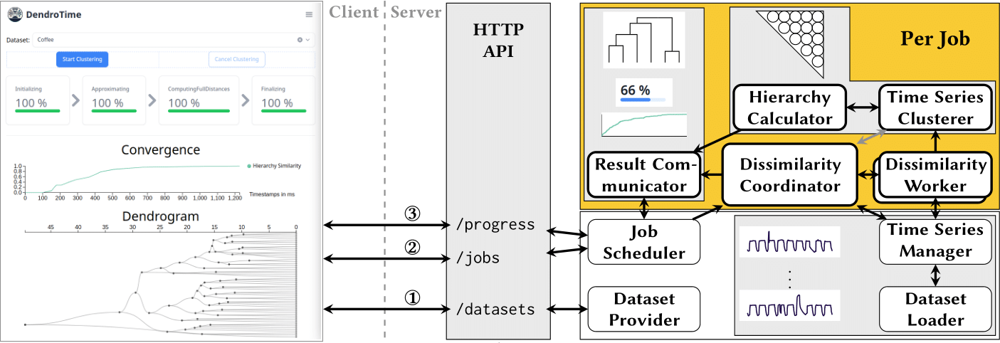
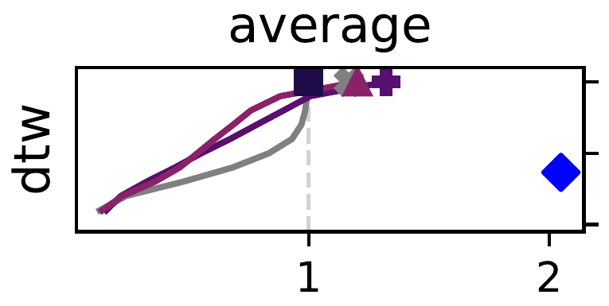

<div align="center">

<h1 align="center">DendroTime</h1>
<p>
Progressive HAC system for time series anomalies.
</p>

[](https://opensource.org/licenses/MIT)


</div>

---

Most effective dissimilarity measures for variable-length time series, such as Dynamic Time Warping (DTW) or Move-Split-Merge (MSM), are expensive to compute because their runtimes increase quadratically with the time series' lengths.
Because hierarchical agglomerative clustering (HAC) algorithms need to compute all pairwise time series dissimilarities, they are slow and do not scale to large time series collections.
However, there are use cases, where fast, interactive hierarchical clustering is necessary.
For these use cases, progressive clustering algorithms can improve runtimes and interactivity.
Progressive algorithms are incremental algorithms that produce and continuously improve an approximate solution, which eventually converges to the exact solution.

We present DendroTime, the first (parallel) progressive clustering system for variable-length time series collections.
The system incrementally computes the pairwise dissimilarities between the input time series and supports different ordering strategies to achieve progressivity.
Our evaluation demonstrates that DendroTime's progressive strategies are very effective for clustering scenarios with expensive time series dissimilarity computations.

### Architecture

DendroTime consists of a reactive client-server architecture that executes the progressive HAC algorithm on a collection of time series (anomalies) in a highly concurrent execution server and visualizes dendrogram updates in a web-based client.
The execution server is implemented using the [_actor programming model (Akka)_](https://doc.akka.io/libraries/akka-core/current/typed/actors.html), which is a reactive programming paradigm for concurrent and parallel applications.
Its core primitives are _actors_, which are objects with private state and behavior.
The following figures provides an overview of DendroTime's client-server architecture and its actors:



DendroTime supports the following measures to compute the dissimilarities between time series:

- Minkowsky distances (i.a., Euclidean)
- MSM
- DTW
- SBD

The following linkage functions are supported and compatible:

- _single_
- _complete_
- _average_
- _weighted_

Other linkage functions, such as Ward or centroid linkage, are not compatible with non-metric time series dissimilarity measures, but can be enabled in code:
[`de.hpi.fgis.dendrotime.model.ParametersModel.DendroTimeParams#areCompatible`](dendrotime-backend/src/main/scala/de/hpi/fgis/dendrotime/model/ParametersModel.scala#L19).
The client is web-based and visualizes the dendrogram as well as the computational and qualitative progress to allow the user to monitor the clustering results over time, and stop the process early.

https://github.com/HPI-Information-Systems/DendroTime/blob/main/docs/videos/DendroTime-clustering-ACSF1.webm


## Repository structure

The following table provides an overview about the most important contents in this repository:

| **Folder**                                             | **Description**                                             |
| :----------------------------------------------------- | :---------------------------------------------------------- |
| _Scala modules_                                        |                                                             |
| [`bloom-filter`](./bloom-filter)                       | Adaptation of Alexandr Nikitin's bloom-filter library for Scala 3 |
| [`progress-bar`](./progress-bar)                       | Progress bar library similar to tqdm, used in Scala-CLI scripts |
| [`dendrotime-io`](./dendrotime-io)                     | DendroTime's IO module: CSV reader and writer, `.ts`-file parser, time series data structure |
| [`dendrotime-clustering`](./dendrotime-clustering)     | DendroTime's clustering module: Time series dissimilarities, linkage methods, MST and NN-chain algorithms, dissimilarity vector, stepwise dendrogram (hierarchy), and corresponding IO. |
| [`dendrotime-frontend`](./dendrotime-frontend)         | DendroTime's frontend (TypeScript, React, TailwindCSS)      |
| [`dendrotime-backend`](./dendrotime-backend)           | **DendroTime system**: Full-featured web application including the frontend |
| [`dendrotime-runner`](./dendrotime-runner)             | **DendroTime runner**: CLI application without the user-facing features, used for paper experiments. |
| [`dendrotime-evaluator`](./dendrotime-evaluator)       | **DendroTime evaluator**: CLI application to compute metrics for dendrograms (hierarchies) |
| [`dendrotime-benchmarking`](./dendrotime-benchmarking) | Contains jmh micro-benchmarks.                              |
| _Folders_                                              |                                                             |
| [`docs`](./docs)                                       | Hosts doc files and resources                               |
| [`experiments`](./experiments)                         | Paper experiment scripts for reproducibility                |
| [`scripts`](./scripts)                                 | Collection of various Scala and Python scripts              |
| _Files_                                                |                                                             |
| [`build.sbt`](./build.sbt)                             | SBT build configuration                                     |
| [`requirements.txt`](./requirements.txt)               | Python dependencies required for the scripts and experiments |

## Experiments and results

DendroTime supports multiple strategies to order the time series dissimilarities.
The following three are the most important ones:

- **fcfs**:
  The fcfs _baseline_ strategy simply orders the dissimilarity computations in the order we load the time series from disk.
- **ada**: The ada strategy defines an ordering heuristic that is based on the dissimilarities from the approximation phase, from small to large.
- **precl**: The precl strategy follows a three-step approach (inspired by JET):
  The first step (intra-pre-cluster) partitions the approximated dendrogram into 3√𝑛 pre-clusters and then computes the exact dissimilarities for all time series pairs within these pre-clusters.
  The second step (medoids) determines the medoid for each pre-cluster and computes the dissimilarities of all medoid pairs.
  The final step (inter-pre-cluster) computes the exact dissimilarities of all inter-pre-cluster pairs.
  We compute the dissimilarities between time series from close pre-clusters before those between far-apart pre-clusters.

We compare DendroTime with two baseline algorithms:

- **PARALLEL** HAC:
  This baseline is a multithreaded Scala implementation of traditional linkage-based HAC.
  It computes the pairwise time series dissimilarities in parallel and, then, constructs the final, exact stepwise dendrogram in the end.
  You can execute the PARALLEL baseline using the DendroTime runner:

  ```bash
  java -jar DendroTime-runner.jar --parallel --dataset <dataset-name>
  ```

  There is also a SERIAL baseline that does not use any parallelism: `--serial`.

- [**JET**](https://github.com/HPI-Information-Systems/jet):
  JET is an approximated algorithm for hierarchical clustering of time series anomalies.
  It is implemented in Python, and we execute it with Python version 3.9.21.
  After computing a coarse-grained pre-clustering of the time series using the very efficient BIRCH algorithm, it computes the exact dissimilarities just for intra-pre-cluster time series and between the pre-cluster medoids.
  The dissimilarity computations are executed in parallel.
  You can execute JET from the `experiments/06-jet/` repository:

  ```bash
  cd experiments/06-jet
  python run-jet.py --datafolder ../../data/datasets --dataset <dataset-name>
  ```




> Horizontal axis shows relative runtime w.r.t the PARALLEL baseline runtime and vertical axis shows dendrogram similarity w.r.t to the exact dendrogram (= quality).

### DendroTime vs. JET

Although JET is an approximate approach for calculating fast HAC sketches, it is on average slower than DendroTime.
For larger datasets, JET's Python overhead diminishes and it is indeed faster.
Nevertheless, DendroTime achieves for all datasets at least similar quality after the same runtime.

### DendroTime vs. PARALLEL

Because DendroTime eventually computes the same result as PARALLEL, but with additional approximation and ordering steps in the process, it takes up to 1.5x time to finish the exact dendrogram, as expected.
Despite DendroTime continuously producing approximate results, its progressive strategies can achieve high qualities in a shorter or similar runtime as PARALLEL.

## Citation

When using this software please cite our paper:

> tbd

## Installation

Please make sure that you have a recent Java runtime environment on your machine.

### Building

#### Prerequisites

- Git
- Java >= 21.0.0
- SBT >= 1.10.0
- (Scala 3 is managed by SBT)
- Node.js >= v22.12.0
- npm >= 11.0.0
- Python >= 3.8

#### Procedure

1. Clone the GitHub repository

   ```bash
   git clone git@github.com:HPI-Information-Systems/DendroTime.git
    ```

2. Build the whole project and create the runtime artifacts.
   The web server version (backend + frontend) is built using:

   ```bash
   sbt assembly
   ```

   If you just want to build the CLI-version use:

   ```bash
   sbt runner/assembly
   ```

   You can find the fat-jar for the DendroTime runner in the `experiments`-folder.

### Usage of the web application

Run DendroTime from sbt with

```sbt
run <hostname> <port>
```

or build a JAR for DendroTime using SBT and then start the application from the JAR-file:

```bash
sbt assembly
mv target/scala-3.3.3/DendroTime-assembly*.jar DendroTime-server.jar
java -Dfile.encoding=UTF-8 -Dlogback.configurationFile=<logging-config-file> -Dconfig.file=<config-file> -jar DendroTime.jar <hostname> <port>
```

You can then access the frontend using a modern browser at `http://<hostname>:<port>/`.

> If no datasets show up in the drop-down menu, please check the path to the datasets-folder in the configuration file!

### Usage from the CLI

We also provide a headless version of DendroTime for experiments and scripts (DendroTime-runner).
It can be started from the CLI and takes the dataset, distance, linkage, and strategy as arguments.
Use `--help` to show options and arguments.

You build the DendroTime-runner using the `runner` SBT-subproject:

```bash
sbt "runner/assembly"
```

The JAR-file will be placed at `experiments/DendroTime-runner.jar`.
Afterward, you can execute the DendroTime-runner with the `./run-dendrotime.sh`-script.
The JAR-file includes the code for the PARALLEL baseline.
It can be executed using the `./run-baseline.sh`-script.

### Algorithm configuration

DendroTime exposes various configuration parameters to control its execution.
They can be configured via CLI or a configuration file.
DendroTime's configuration options are described in [_DendroTime configuration_](./docs/configuration.md)

## Experiments & Reproducibility

The configuration of DendroTime and the baselines used for the experiments in the paper can be found in the [`experiments`-folder](./experiments/).
Note that we do not publish the results of the experiments in this Github-Repository due to their size.
Please contact us directly for the experiments' result backups.
